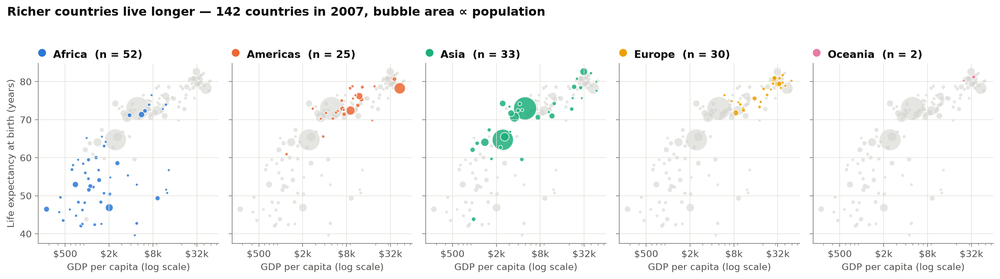
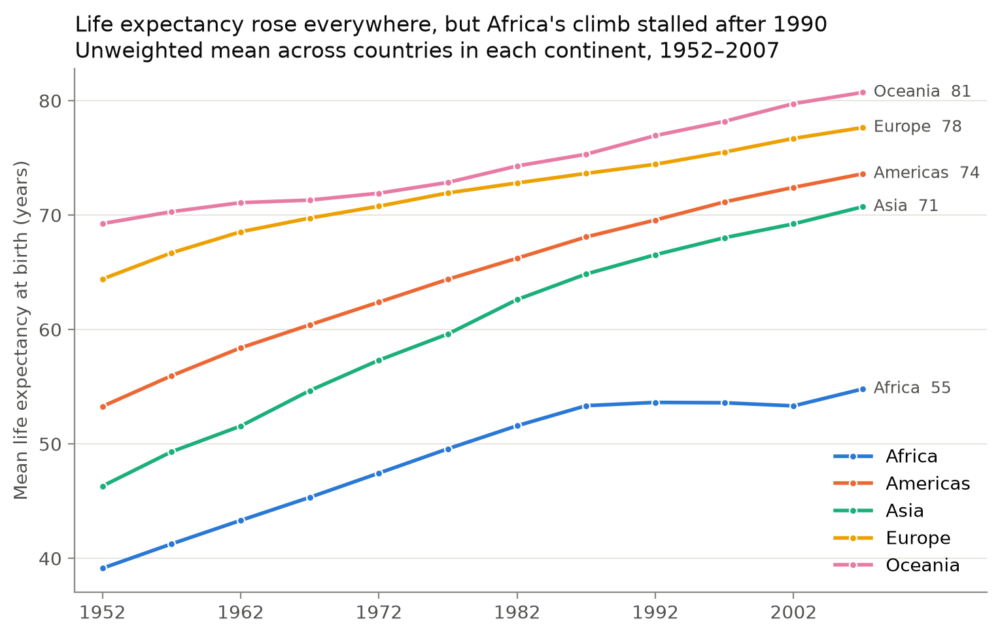

# Income and Life Expectancy, 1952–2007

**Homework #2: Collaborative Data Wrangling & EDA**
**DSE 511 – Fall 2026**

**Team:** Partner A — *Haneen Beshtawi* · Partner B — *Mehmed Said San*

Gapminder's country-year panel (142 countries, 12 five-yearly snapshots from 1952 to
2007) is one of the most widely used teaching datasets in data science, but the raw
export is not analysis-ready: it carries a meaningless index column, terse camelCase
names, and no derived measures. This repository first turns that raw file into a
documented, validated table (`data/processed/gapminder_clean.csv`, built by
`src/clean_data.py`) and then asks **whether the 27-year gain in median life
expectancy over those 55 years tracked income**. It did, tightly, once income is
measured on a log scale (r ≈ 0.81), but the gap between Africa and every other
continent widened rather than closed after 1990. Partner A owns the cleaning pipeline;
Partner B owns the analysis in `notebooks/EDA.ipynb`, which generates every table and
figure in this README.

---

## Dataset Information

| | |
|---|---|
| **Source** | Gapminder Foundation, distributed as the `gapminder` R package data extract (Bryan, J. 2017, *gapminder: Data from Gapminder*). Underlying data: <https://www.gapminder.org/data/> |
| **Date accessed** | 2 September 2026 |
| **File** | `data/raw/gapminder.csv` |
| **Size** | 100 KB · 1,704 rows × 6 variables (after dropping the exported row index) |
| **Scope** | 142 countries × 12 years (1952–2007, every 5th year) — a balanced panel |
| **License** | CC BY 4.0 (Gapminder) |

### Variables (raw)

| Column | Type | Unit / values | Description |
|---|---|---|---|
| `country` | text | 142 country names | Country, constant across years |
| `continent` | text | Africa, Americas, Asia, Europe, Oceania | Continent grouping |
| `year` | integer | 1952–2007, step 5 | Observation year |
| `lifeExp` | float | years | Life expectancy at birth |
| `pop` | integer | persons | Total population |
| `gdpPercap` | float | 2007 international \$ (PPP) | GDP per capita |

### Variables added during cleaning

| Column | Unit | Description |
|---|---|---|
| `gdp_total_bn` | billions of international \$ | `population × gdp_per_capita ÷ 1e9` |
| `log_gdp_per_capita` | log₁₀(international \$) | Log income — the scale on which the income/longevity relationship is linear |

---

## Methods

### Data Cleaning (Partner A)

The pipeline is `src/clean_data.py`; run `python src/clean_data.py` from the
repository root. Each step prints what it checked and what it changed.

| Step | What it does | Result on this extract |
|---|---|---|
| 1. Drop export index | Removes the unnamed row-number column written by the R `write.csv` export | 7 columns → 6 |
| 2. Rename variables | `lifeExp` → `life_expectancy`, `pop` → `population`, `gdpPercap` → `gdp_per_capita` (snake_case throughout) | 6 descriptive names |
| 3. Enforce dtypes | `year` int16, `population` int64, `life_expectancy` and `gdp_per_capita` float64, `country` string (whitespace stripped), `continent` category | no silent type coercion downstream |
| 4. Missing values | Counts NA per column; drops any row missing a key variable | 0 missing, 0 rows dropped |
| 5. Integrity checks | Drops duplicate (`country`, `year`) keys; drops rows with non-positive life expectancy, GDP or population; confirms every country has all 12 years | 0 duplicates, 0 invalid, balanced panel |
| 6. Derived variables | `gdp_total_bn = population × gdp_per_capita / 1e9`; `log_gdp_per_capita = log10(gdp_per_capita)` | 6 columns → 8 |
| 7. Sort and write | Sorts by `country`, `year` and writes `data/processed/gapminder_clean.csv` | 1,704 rows × 8 columns, 142 countries, 1952–2007 |

The checks in steps 4 and 5 all pass with nothing removed, so the cleaned file has
the same 1,704 country-years as the raw one. They are kept in the pipeline so the
result is verified rather than assumed.

**Tools:** pandas 3.0 (reading, renaming, grouping, writing), numpy (log transform),
pathlib (paths relative to the repository root).

### Exploratory Data Analysis (Partner B)

All analysis lives in `notebooks/EDA.ipynb` and reads `data/processed/gapminder_clean.csv`
(if that file is missing the notebook re-runs `src/clean_data.py` first).
Libraries: pandas, numpy, matplotlib.

**Descriptive statistics (4)**

| # | Statistic | Method |
|---|---|---|
| 1 | Summary of numeric variables (count, mean, std, quartiles, skew) | `DataFrame.describe()` + `skew()` |
| 2 | 1952 vs 2007 comparison — mean, median, min, max of life expectancy and GDP per capita, and the change | `groupby("year").agg` |
| 3 | Continent means and medians in 2007 | `groupby("continent").agg` |
| 4 | Correlation between life expectancy and income: Pearson on dollars vs log₁₀ dollars, Spearman, and Pearson within each year | `Series.corr` |

**Visualizations (3)** — all written to `figures/` by the notebook, never screenshotted.

| File | Type | What it shows |
|---|---|---|
| `figures/fig1_income_vs_life_expectancy_2007.png` | Bubble scatter, small multiples (one panel per continent) | GDP per capita (log) vs life expectancy in 2007, bubble area ∝ population |
| `figures/fig2_life_expectancy_by_continent.png` | Line chart | Mean life expectancy per continent, 1952–2007 |
| `figures/fig3_life_expectancy_distribution_1952_vs_2007.png` | Overlaid histogram | Distribution of life expectancy across countries in 1952 and 2007, with medians |

Colours are assigned once per continent and reused in every figure; text never relies on colour alone.

## Results

| Finding | Number |
|---|---|
| Median life expectancy, 1952 → 2007 | 45.1 → 71.9 years (+26.8) |
| Median GDP per capita, 1952 → 2007 | \$1,969 → \$6,124 (2007 international \$) |
| Pearson r, life expectancy vs GDP per capita (dollars) | 0.58 |
| Pearson r, life expectancy vs log₁₀ GDP per capita | 0.81 |
| Spearman ρ (either scale) | 0.83 |
| Mean life expectancy in 2007: Oceania / Europe / Americas / Asia / Africa | 80.7 / 77.6 / 73.6 / 70.7 / 54.8 |

1. **Income and longevity are tightly linked, but on a log scale.** Doubling income buys roughly the
   same extra years whether a country starts at \$1,000 or \$20,000; on raw dollars the relationship
   looks weaker (r = 0.58) only because a handful of very rich countries stretch the axis.
2. **The whole world moved up.** In 1952 the distribution of life expectancy was two-humped
   (a large cluster near 40 years, a small rich cluster near 70); by 2007 most countries sit above 70.
3. **Africa is the exception.** Every continent's mean rose steadily except Africa's, which flattened
   at about 53 years from 1987 to 2002 (the HIV/AIDS era) and in 2007 still trailed Asia by 16 years.





**Reflection.** The surprise was how *stable* the income–longevity correlation is: within every single
year from 1952 to 2007 the Pearson r with log income sits between 0.75 and 0.87. What changed over the
half-century is not the slope of the relationship but where countries sit along it.

## Collaboration Notes

- **Partner A (Haneen Beshtawi):** repository setup, raw data acquisition, `src/clean_data.py`
  (index drop, renaming, dtypes, missing/duplicate/range checks, derived variables), cleaned CSV,
  Dataset Information and Data Cleaning sections of this README.
- **Partner B (Mehmed Said San):** `notebooks/EDA.ipynb` — four descriptive statistics and three
  figures — plus the EDA, Results, Reproducibility and Collaboration sections of this README.
- **Both:** README introduction, pull-request review, merge-conflict resolution.

## Reproducibility Instructions

```bash
git clone https://github.com/msdsn/dse-hw2.git
cd dse-hw2
python -m venv .venv && source .venv/bin/activate     # optional
pip install -r requirements.txt

python src/clean_data.py                              # raw -> data/processed/gapminder_clean.csv
jupyter nbconvert --to notebook --execute --inplace notebooks/EDA.ipynb   # or open it in Jupyter
```

The notebook writes the three PNGs to `figures/`. Tested with Python 3.11, pandas 3.0, matplotlib 3.11.

## Merge Conflict Reflection

**What conflicted.** Both partners edited the README introduction on their own branches,
deliberately and without coordinating the wording. Partner A's version (PR #1) framed the
project around the cleaning pipeline: the raw export's index column, camelCase names and
missing derived measures. Partner B's version (PR #2) framed it around the result: the
27-year gain in median life expectancy and the r ≈ 0.81 correlation with log income.
PR #1 was merged first; when `main` was then merged into `partner-b-eda`, Git could not
reconcile the two paragraphs and stopped with `<<<<<<< HEAD` / `=======` / `>>>>>>>`
markers around them in `README.md`. Every other change merged automatically, including
Partner A's Data Cleaning section and Partner B's EDA and Results sections, because they
touched different parts of the file.

**How we resolved it.** We did not pick one side. We read both paragraphs, kept Partner A's
description of what the raw data lacks and what the pipeline produces, and folded in
Partner B's headline finding and the pointer to the notebook, so the intro now describes
both the data work and the answer. We removed the markers, checked the file rendered,
and committed the merge (`git add README.md && git commit`). The resolved branch was
pushed so PR #2 became mergeable on GitHub.

**What we learned.** A conflict is Git asking a human to make an editorial decision, not
an error. Merging the first PR promptly and rebasing or merging `main` into the second
branch locally, where the full file and a real editor are available, was easier than
GitHub's web conflict editor. We also learned to keep the rest of our edits in separate
sections so that the intended conflict stayed small and easy to reason about.
